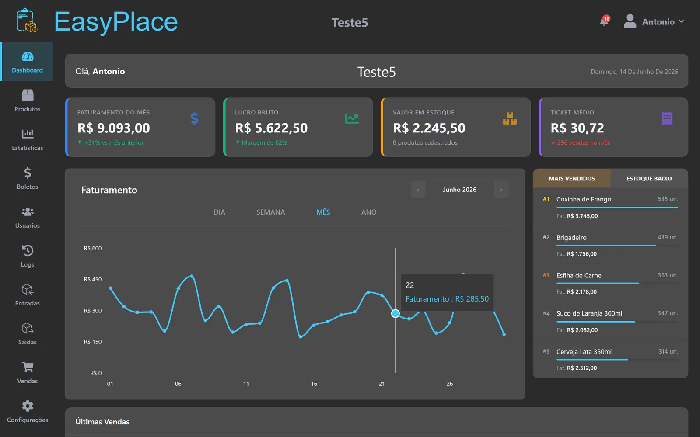
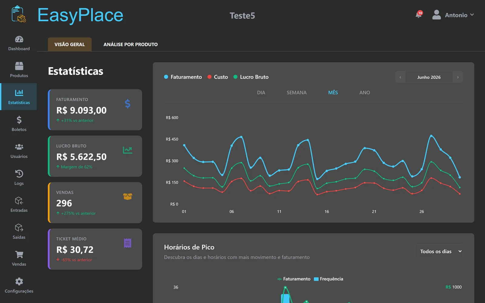
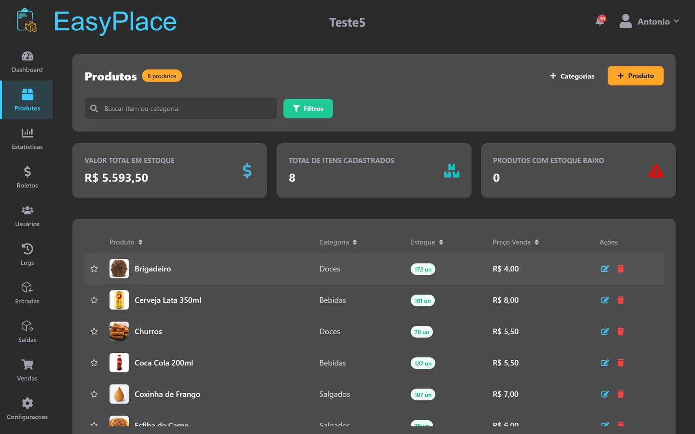
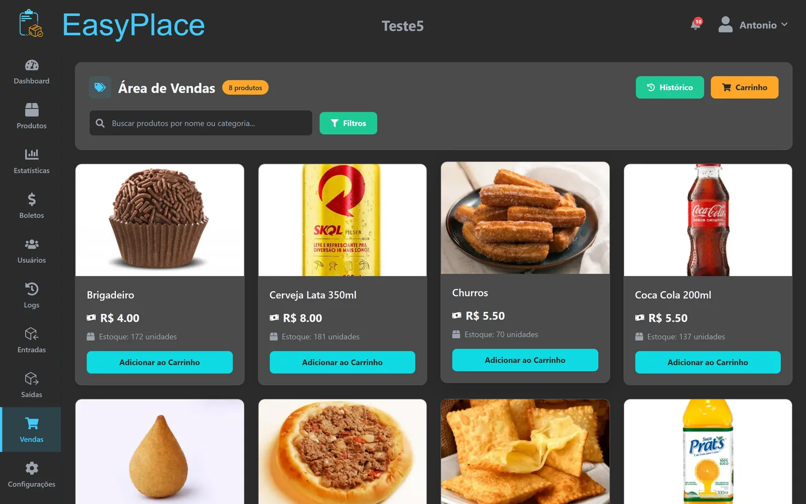
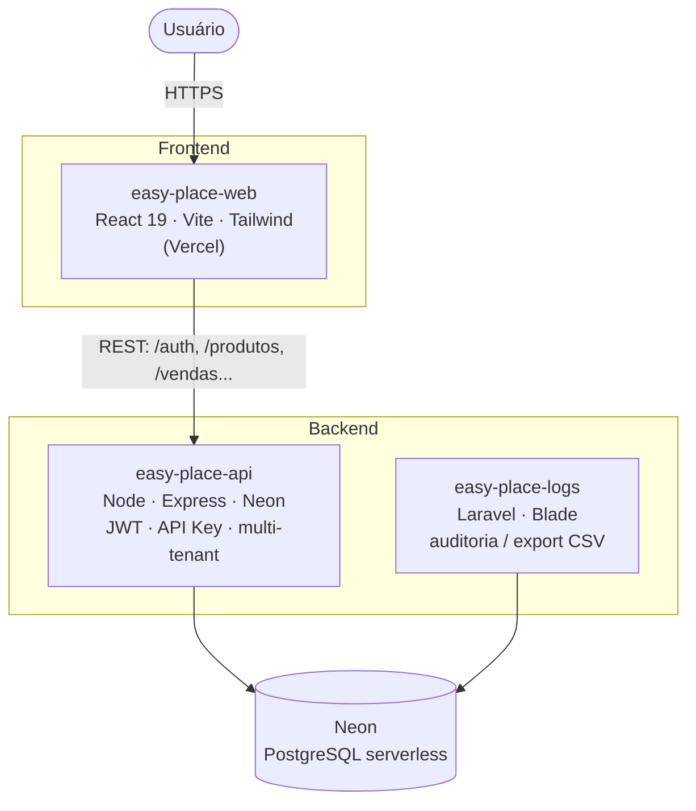

<h1 align="center">Easy Place</h1>

  <b>Sistema multi-tenant de gestão de estoque, vendas (PDV) e finanças para o varejo.</b>
   
  Projeto acadêmico supervisionado desenvolvido para um cliente real — a <b>Adega do Tom</b>.

  
  
  

  
  
  
  
   
  
  
  

---

## Sobre o projeto

O **Easy Place** é um sistema de gestão para pequenos comércios, criado para **otimizar o controle de estoque, registrar vendas e organizar as finanças** do cliente. Nasceu de reuniões de levantamento de requisitos com a Adega do Tom e evoluiu para uma plataforma **multi-tenant** — cada empresa cadastrada tem seus dados totalmente isolados.

> Desenvolvido no curso de **Análise e Desenvolvimento de Sistemas da FATEC Guaratinguetá**, como projeto supervisionado para um cliente real.

---

## Interface

  

|  |  |
|:---:|:---:|
| **Dashboard** | **Estatísticas** |
|  |  |
| **Produtos** | **PDV — Ponto de Venda** |
|  |  |

Telas da empresa de demonstração (dados fictícios).

---

## Funcionalidades

- **Multi-tenancy** — isolamento total de dados por empresa (`ID_EMPRESA`).
- **Perfis de acesso** com rotas protegidas por papel (RBAC):
  - **Proprietário** — acesso completo
  - **Subproprietário** — acesso completo, como o proprietário (sócio/gestor delegado)
  - **Gerente** — produtos, estoque, vendas e relatórios
  - **Atendente** — PDV de vendas
- **PDV (Ponto de Venda)** dedicado, com layout próprio.
- **Estoque** — produtos, categorias, fornecedores, entradas/saídas, movimentações e perdas.
- **Financeiro** — vendas, formas de pagamento, boletos e solicitações de cancelamento.
- **Dashboard e estatísticas** com gráficos (Recharts).
- **Autenticação dupla** — JWT (usuários) e API Key (integrações).
- **Sessão deslizante** — token renovado automaticamente via header de resposta.
- **Confirmação de e-mail** e recuperação de senha.
- **Painel de auditoria** separado (logs do sistema, com exportação CSV).

---

## Arquitetura

O Easy Place é dividido em **três serviços independentes** que compartilham um banco de dados Neon (PostgreSQL serverless) na nuvem:

| Camada | Repositório | Stack |
|---|---|---|
| **Frontend** | `easy-place-web` | React 19, React Router v7, Vite, Axios, Recharts, TailwindCSS |
| **Backend** | `easy-place-api` | Node.js, Express, Neon (PostgreSQL serverless), JWT, Zod, Helmet, rate-limit |
| **Auditoria** | `easy-place-logs` | Laravel 13, PHP 8.3, Blade |

---

## Desafios técnicos e lições aprendidas

- **Multi-tenancy seguro** — garantir que *nenhuma* query vaze dados entre empresas. Resolvido isolando tudo por `ID_EMPRESA`, sempre derivado do token/API Key (nunca do corpo da requisição), reforçado no middleware.
- **Autenticação flexível** — um mesmo middleware (`resolveAuth`) aceita **JWT** (usuários humanos) e **API Key** (integrações), resolvendo a empresa e o perfil em cada caso.
- **Controle de acesso por perfil (RBAC)** — rotas e telas liberadas conforme o papel do usuário, com o PDV do atendente isolado em um layout próprio.
- **Modelagem de domínio rica** — mais de 20 entidades (produtos, vendas, movimentações, boletos, perdas, cancelamentos) mantendo integridade referencial e histórico.
- **Deploy serverless** — ajustar a conexão serverless com o Neon (driver WebSocket/pooler) para rodar na Vercel sem esgotar conexões.

---

## Minhas responsabilidades

Atuei como **desenvolvedor full stack** ao longo de todo o ciclo do projeto:

- **Levantamento de requisitos** — reuniões com o cliente, definição de escopo e fluxos do sistema.
- **Modelagem do banco (SQL)** — do DER ao schema físico em PostgreSQL no Neon (20+ entidades).
- **Backend** — regras de negócio, autenticação e multi-tenancy na API.
- **Frontend** — desenvolvimento das telas em React.
- **Testes de API** — validação de endpoints e payloads com Postman.
- **Versionamento e deploy** — Git/GitHub (branches, merges) e publicação na Vercel.
- **Desenvolvimento assistido por IA** — condução do projeto com ferramentas de IA agêntica, mantendo a revisão humana das decisões de arquitetura e regras de negócio.

---

## Desenvolvimento assistido por IA

  
  

O Easy Place foi construído com um fluxo de **desenvolvimento full stack potencializado por IA**, usando ferramentas de IA agêntica como **Claude Code** (Anthropic) e **Google Antigravity** ao longo de todo o ciclo:

- **Geração e refatoração de código** em frontend (React) e backend (Node + Neon).
- **Depuração e análise** — investigação de bugs e do schema do banco direto pelos agentes.
- **Documentação** — apoio na escrita de READMEs, comentários e diagramas.
- **Automação** — otimização de imagens, scripts de inspeção e tarefas repetitivas.

A IA acelerou a entrega, mas as **decisões de arquitetura, modelagem e regras de negócio permaneceram sob revisão humana** — o papel do desenvolvedor passou a ser orquestrar, revisar e validar o que os agentes produzem.

---

## Confidencialidade

Por se tratar de um projeto para um **cliente real**, o código-fonte é **privado**. Este repositório é uma **vitrine** que documenta a arquitetura, as decisões técnicas e minhas responsabilidades no projeto.

---

  Feito por <b>Antonio Carvalho</b> ·
  <a href="mailto:antoniocarvdroid@gmail.com">antoniocarvdroid@gmail.com</a>

