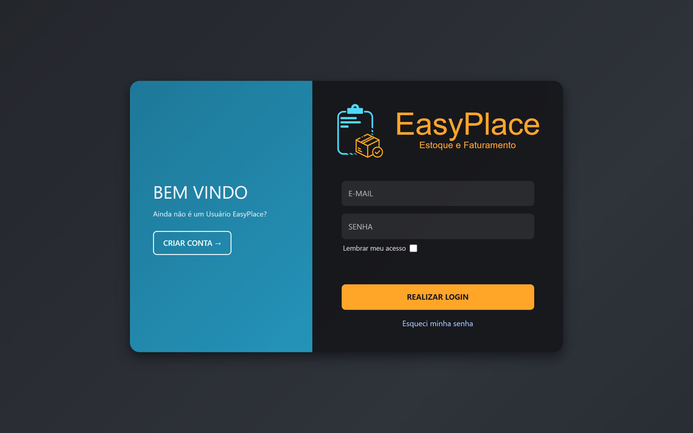

<h1 align="center">🍷 Easy Place</h1>

<p align="center">
  <b>Sistema multi-tenant de gestão de estoque, vendas (PDV) e finanças para o varejo.</b>
  <br/>
  Projeto acadêmico supervisionado desenvolvido para um cliente real — a <b>Adega do Tom</b>.
</p>

<p align="center">
  
  
  
</p>

<p align="center">
  
  
  
  
  
  
  
  
</p>

---

## 📸 Interface

<p align="center">
  
</p>

<!-- Mais telas (Dashboard, PDV de Vendas, Produtos, Financeiro) serão adicionadas aqui. -->

---

## 🎯 Sobre o projeto

O **Easy Place** é um sistema de gestão para pequenos comércios, criado para **otimizar o controle de estoque, registrar vendas e organizar as finanças** do cliente. Foi concebido a partir de reuniões de levantamento de requisitos com a Adega do Tom e evoluiu para uma plataforma **multi-tenant** — cada empresa cadastrada tem seus dados totalmente isolados.

> Desenvolvido no curso de **Análise e Desenvolvimento de Sistemas da FATEC Guaratinguetá**, como projeto supervisionado para um cliente real.

---

## ✨ Funcionalidades

- 🔐 **Multi-tenancy** — isolamento total de dados por empresa (`ID_EMPRESA`).
- 👥 **3 perfis de acesso** com rotas protegidas por papel:
  - **Proprietário** — acesso completo
  - **Gerente** — dashboard, produtos, estoque, finanças e estatísticas
  - **Atendente** — PDV de vendas
- 🛒 **PDV (Ponto de Venda)** dedicado para o atendente.
- 📦 **Estoque** — produtos, categorias, fornecedores, movimentações, perdas.
- 💰 **Financeiro** — vendas, formas de pagamento, boletos, cancelamentos.
- 📊 **Dashboard e estatísticas** com gráficos (Recharts).
- 🔑 **Autenticação dupla** — JWT (usuários) e API Key (integrações).
- ✉️ **Confirmação de e-mail** e recuperação de senha.
- 📝 **Painel de auditoria** separado (logs do sistema, com exportação CSV).

---

## 🏗️ Arquitetura

O Easy Place é dividido em três serviços independentes:

```
┌─────────────────┐      ┌──────────────────┐      ┌─────────────────┐
│  easy-place-web │      │  easy-place-api  │      │ easy-place-logs │
│  React + Vite   │─────▶│  Node + Express  │◀────▶│  Laravel (PHP)  │
│  (Vercel)       │ HTTP │  Prisma          │      │  Painel de logs │
└─────────────────┘      └────────┬─────────┘      └────────┬────────┘
                                  │                          │
                                  ▼                          │
                         ┌──────────────────┐                │
                         │  PostgreSQL Neon │◀───────────────┘
                         └──────────────────┘
```

| Camada | Repositório | Stack |
|---|---|---|
| **Frontend** | `easy-place-web` | React 19, React Router v7, Vite, Axios, Recharts, TailwindCSS |
| **Backend** | `easy-place-api` | Node.js, Express, Prisma, PostgreSQL (Neon), JWT, Zod, Helmet, rate-limit |
| **Auditoria** | `easy-place-logs` | Laravel 13, PHP 8.3, Blade |

---

## 🚀 Demo

> **Link:** [easy-place-web.vercel.app](https://easy-place-web.vercel.app/#/login)

**Credenciais de teste:**

| Perfil | Login | Senha |
|---|---|---|
| Administrador | `admin` | `12345` |
| Atendente | `atendente` | `12345` |

> ⚠️ A demo depende de uma API e banco em nuvem (camada gratuita) que podem hibernar. Se o login retornar erro de conexão, a aplicação está "dormindo" — as imagens acima mostram a interface.

---

## 💻 Minhas responsabilidades

Atuei como **desenvolvedor full stack** ao longo de todo o ciclo do projeto:

- **Levantamento de requisitos** — reuniões com o cliente, definição de escopo e fluxos do sistema.
- **Modelagem do banco (SQL)** — do DER ao schema físico em PostgreSQL/Prisma (20+ entidades).
- **Backend** — implementação de regras de negócio, autenticação e multi-tenancy na API.
- **Frontend** — desenvolvimento das telas em React.
- **Testes de API** — validação de endpoints e payloads com Postman.
- **Versionamento e deploy** — Git/GitHub (branches, merges) e publicação na Vercel.

---

## 🔒 Confidencialidade

Por se tratar de um projeto para um **cliente real**, o código-fonte é **privado**. Este repositório é uma **vitrine** que documenta a arquitetura, as decisões técnicas e minhas responsabilidades no projeto.

---

<p align="center">
  Feito por <b>Antonio Carvalho</b> ·
  <a href="mailto:antoniocarvdroid@gmail.com">antoniocarvdroid@gmail.com</a>
</p>
